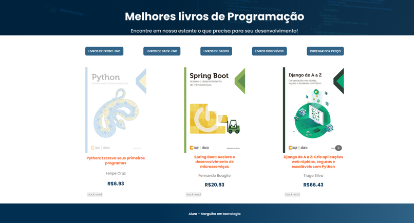

# Projetos Alura Oracle - ONE
 > Oracle Next Education Oracle

<h2 align="center">Projeto de manipulação de livros | Casa do Código</h2>

    </img>
    </img>
    </img>

### Linguagens utilizadas
 - HTML
 - CSS
 - Javascript
 - Json